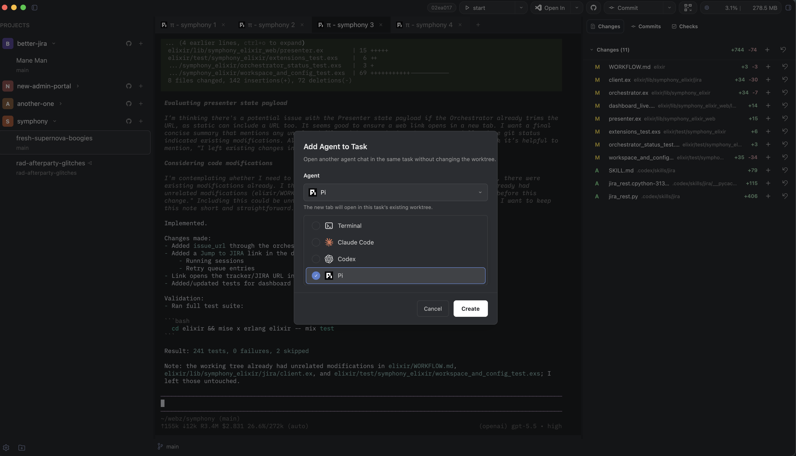

# AnotherOne

AnotherOne is a greenfield desktop and mobile app built around local agent
workflows.



## Development

Run the desktop app:

```sh
bash ./scripts/dev-watch.sh
```

The desktop target is macOS and Linux.

## Releasing for your own Mac

On macOS, build a locally signed `.app` bundle and `.dmg` with:

```sh
scripts/package-macos.sh
```

The package lands under `target/release/macos/`. To open the generated DMG
when packaging finishes, pass `--open`:

```sh
scripts/package-macos.sh --open
```

This is intended for personal installs on your own Mac. It uses ad-hoc
codesigning, so it is not a notarized public distribution build.
